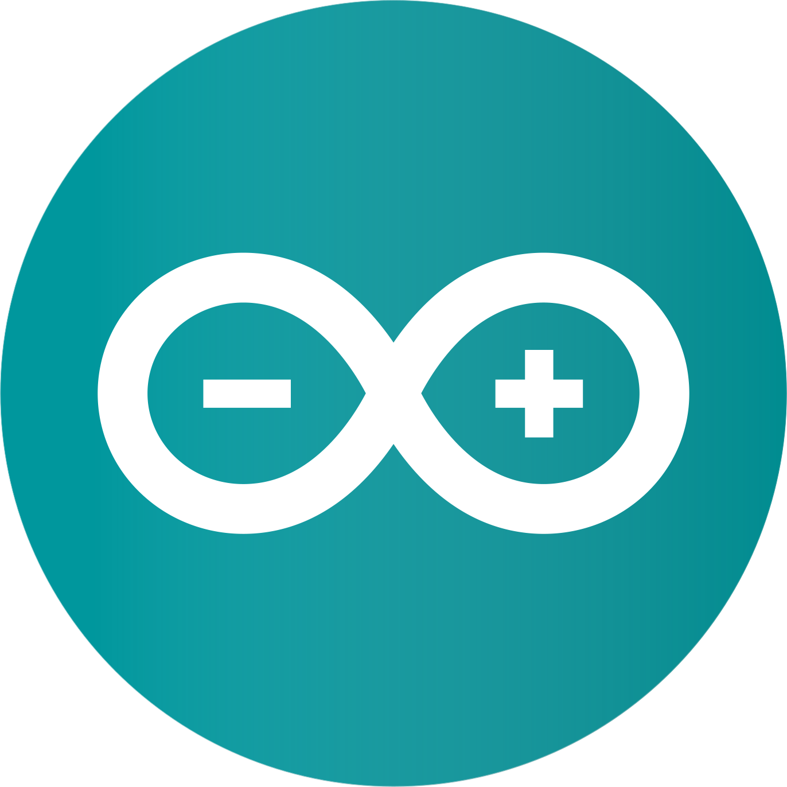

<h1 style="border-bottom: none" align="center">
    
</h1>

<h4 align="center">
    
    
    
</h4>

<h2 align="center">Language and Tools</h2>

    <code></code>
    <code></code>
    <code></code>
    <code></code>
    <code></code>
    <code></code>
    <code></code>
    <code></code>
    <code></code>

<h2 align="center">My Working Environment</h2>

    <code></code>
    <code></code>
    <code></code>
    <code></code>
    <code></code>

<h2 align="center">Stats</h2>

    
    

    
    

 

    

